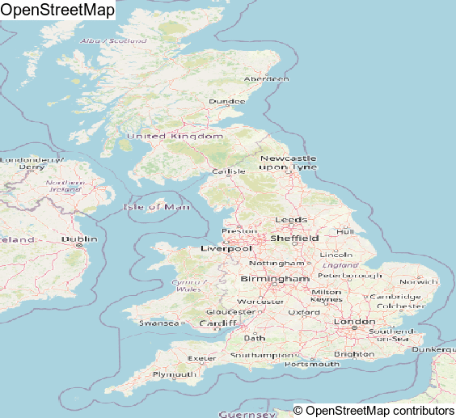

<!-- README.md is generated from README.Rmd. Please edit that file -->

# wombats 

<!-- badges: start -->
<!-- badges: end -->

The goal of wombats is to …

## Installation

You can install the development version of wombats from
[GitHub](https://github.com/) with:

``` r
# install.packages("devtools")
devtools::install_github("UchidaMizuki/wombats")
```

## Example

``` r
library(wombats)
library(rnaturalearth)

wmts_osm <- read_wmts("https://osmlab.github.io/wmts-osm/WMTSCapabilities.xml")

tiles_uk <- rnaturalearth::ne_countries(country = "united kingdom") |> 
  wmts_tiles(wmts_osm)

animate_wmts_tiles(tiles_uk) |> 
  magick::image_annotate("© OpenStreetMap contributors",
                         gravity = "southeast",
                         size = 15,
                         boxcolor = "white")
```


